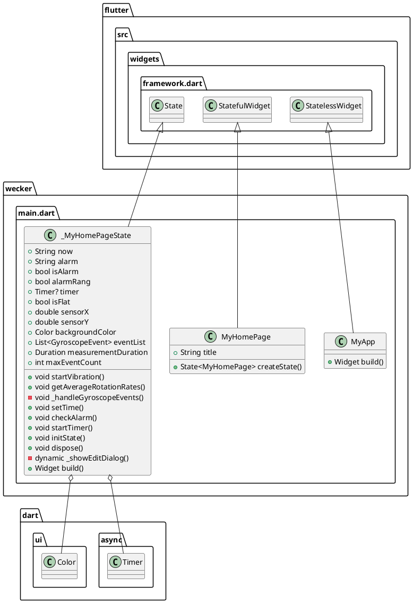

## uml: sequence diagram

```plantuml
@startuml
set namespaceSeparator ::

class "wecker::main.dart::MyApp" {
  +Widget build()
}

"flutter::src::widgets::framework.dart::StatelessWidget" <|-- "wecker::main.dart::MyApp"

class "wecker::main.dart::MyHomePage" {
  +String title
  +State<MyHomePage> createState()
}

"flutter::src::widgets::framework.dart::StatefulWidget" <|-- "wecker::main.dart::MyHomePage"

class "wecker::main.dart::_MyHomePageState" {
  +String now
  +String alarm
  +bool isAlarm
  +bool alarmRang
  +Timer? timer
  +bool isFlat
  +double sensorX
  +double sensorY
  +Color backgroundColor
  +List<GyroscopeEvent> eventList
  +Duration measurementDuration
  +int maxEventCount
  +void startVibration()
  +void getAverageRotationRates()
  -void _handleGyroscopeEvents()
  +void setTime()
  +void checkAlarm()
  +void startTimer()
  +void initState()
  +void dispose()
  -dynamic _showEditDialog()
  +Widget build()
}

"wecker::main.dart::_MyHomePageState" o-- "dart::async::Timer"
"wecker::main.dart::_MyHomePageState" o-- "dart::ui::Color"
"flutter::src::widgets::framework.dart::State" <|-- "wecker::main.dart::_MyHomePageState"


@enduml
```